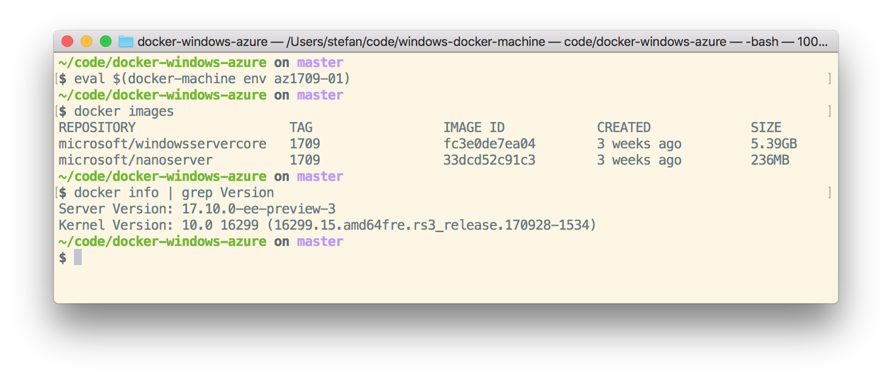

# docker-windows-azure

<a href="https://portal.azure.com/#create/Microsoft.Template/uri/https%3A%2F%2Fraw.githubusercontent.com%2FStefanScherer%2Fdocker-windows-azure%2Fmaster%2Fazuredeploy.json" target="_blank">
    
</a>
<a href="http://armviz.io/#/?load=https%3A%2F%2Fraw.githubusercontent.com%2FStefanScherer%2Fdocker-windows-azure%2Fmaster%2Fazuredeploy.json" target="_blank">
    
</a>

This template will deploy and configure a Windows Server 2016 VM instance with Windows Server Containers and Docker Engine 1.13.0. These items are performed by the template:

* Deploy the prepared Windows Server Container Image with Docker 1.13.0
  * base OS image microsoft/windowsservercore:10.0.14393.693
  * base OS image microsoft/nanoserver:10.0.14393.693
* Create TLS certificates for the Docker Engine
* Open Ports for RDP and Docker (HTTP secure).
* Install additional Docker tools:
  * Docker Compose 1.10.0
  * Docker Machine 0.9.0

## azure-cli

Additional to the "Deploy to Azure" button above you can deploy the VM with the `azure` cli as well:

```
azure config mode arm
azure group deployment create Group docker \
  --template-uri https://raw.githubusercontent.com/StefanScherer/docker-windows-azure/master/azuredeploy.json \
  -p '{
    "adminUsername": {"value": "docker"},
    "adminPassword": {"value": "Super$ecretPass123"},
    "dnsNameForPublicIP": {"value": "docker"},
    "VMName": {"value": "docker"},
    "location": {"value": "North Europe"}
    }'
```

To retrieve the IP address or the FQDN use these commands

```bash
azure vm show Group docker | grep "Public IP address" | cut -d : -f 3
1.2.3.4

azure vm show Group docker | grep FQDN | cut -d : -f 3 | head -1
docker.northeurope.cloudapp.azure.com
```

## Connect to Docker Engine

To connect to the Windows Docker Engine from a notebook you just have to copy the TLS certificates
for the user's profile to your home directory.

The thee `unset` commands are useful if you use `docker-machine` to connect to different VM's with TLS. This turns off TLS so you can then run `docker` commands like

```bash
docker images
```


or start your first Windows container eg. from your Mac

```bash
docker run -it windowsservercore cmd
```


## Credits

This work is based on the Azure quickstart templates
* https://github.com/Azure/azure-quickstart-templates/tree/master/windows-server-containers-preview
* https://github.com/Azure/azure-quickstart-templates/tree/master/201-vm-winrm-windows
