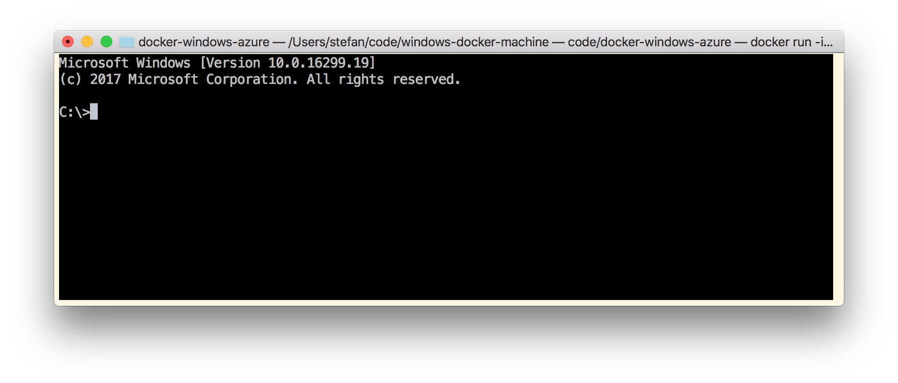

# docker-windows-azure

## Windows Server 2016 LTS channel

<a href="https://portal.azure.com/#create/Microsoft.Template/uri/https%3A%2F%2Fraw.githubusercontent.com%2FStefanScherer%2Fdocker-windows-azure%2Fmaster%2F2016%2Fazuredeploy.json" target="_blank">
    
</a>
<a href="http://armviz.io/#/?load=https%3A%2F%2Fraw.githubusercontent.com%2FStefanScherer%2Fdocker-windows-azure%2Fmaster%2F2016%2Fazuredeploy.json" target="_blank">
    
</a>

## Windows Server 1709 Semi-annual channel

<a href="https://portal.azure.com/#create/Microsoft.Template/uri/https%3A%2F%2Fraw.githubusercontent.com%2FStefanScherer%2Fdocker-windows-azure%2Fmaster%2F1709%2Fazuredeploy.json" target="_blank">
    
</a>
<a href="http://armviz.io/#/?load=https%3A%2F%2Fraw.githubusercontent.com%2FStefanScherer%2Fdocker-windows-azure%2Fmaster%2F1709%2Fazuredeploy.json" target="_blank">
    
</a>

## Windows Server 1803 Semi-annual channel

<a href="https://portal.azure.com/#create/Microsoft.Template/uri/https%3A%2F%2Fraw.githubusercontent.com%2FStefanScherer%2Fdocker-windows-azure%2Fmaster%2F1803%2Fazuredeploy.json" target="_blank">
    
</a>
<a href="http://armviz.io/#/?load=https%3A%2F%2Fraw.githubusercontent.com%2FStefanScherer%2Fdocker-windows-azure%2Fmaster%2F1803%2Fazuredeploy.json" target="_blank">
    
</a>

## Deployment

These templates will deploy and configure a Windows Server 2016/1709 VM instance with Windows Server Containers and Docker Engine 17.06.2-ee-10. These items are performed by the template:

* Deploy the prepared Windows Server Container Image with Docker 17.06.2 EE 10
  * base OS image microsoft/windowsservercore:\*
  * base OS image microsoft/nanoserver:\*
* Create TLS certificates for the Docker Engine
* Prepare a `docker-machine` configuration in `C:\.docker\machine\machines`
* Open Ports for RDP (3389), Docker (2376), as well as HTTP (80) and HTTPS (443).
* Install additional Docker tools:
  * Docker Compose
  * Docker Machine

Specify your local home directory path in `machineHome` so the docker-machine config can be created exactly for your needs. Use the value of `%USERPROFILE%` on Windows and `$HOME` on Linux/Mac.


## Connect to Docker Engine

To connect to the Windows Docker Engine from a notebook you just have to copy the TLS certificates
from the Azure VM `C:\.docker\machine\machines` to your home directory -> `.docker/machine/machines`. Use the RDP session and copy the folder through RDP. For 1709 server core it is also possible. Just open `notepad`, then `Open` a file, browse to `C:\.docker` and CTRL+C the folder.


Paste the folder into the home directory of your local user account.

Now you can use the local `docker-machine` binary to switch environment variables to connect to the Docker engine running in the Azure VM.

Bash

```bash
$ eval $(docker-machine env az1709)
```

PowerShell

```bash
PS C:\> docker-machine env az1709 | iex
```

Now you are connected with the TLS protected Docker API of your Azure VM.

```bash
docker images
```


or start your first Windows container eg. from your Mac

```bash
docker run -it microsoft/windowsservercore:1709 cmd
```



## Credits

This work is based on the Azure quickstart templates

* https://github.com/Azure/azure-quickstart-templates/tree/master/windows-server-containers-preview
* https://github.com/Azure/azure-quickstart-templates/tree/master/201-vm-winrm-windows
